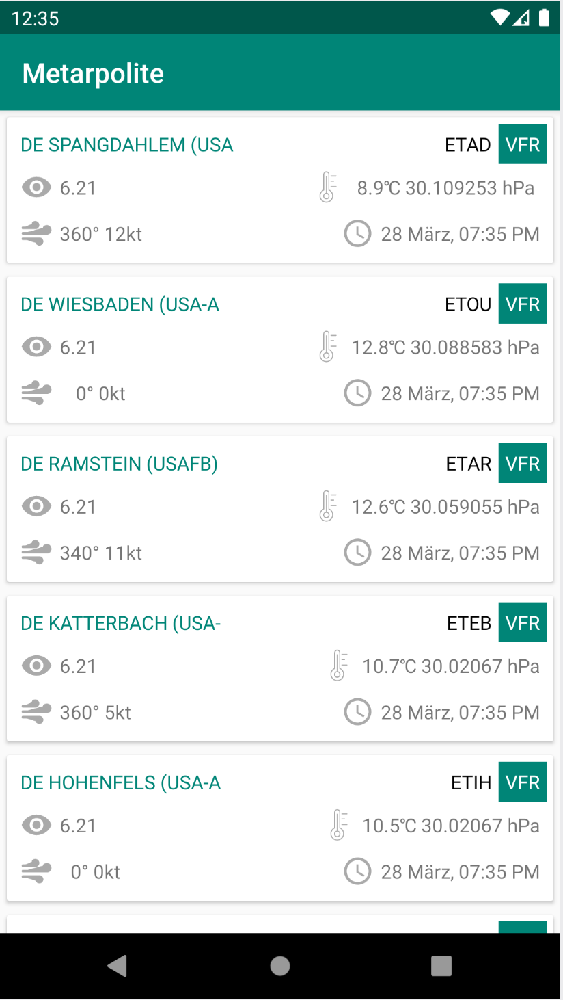
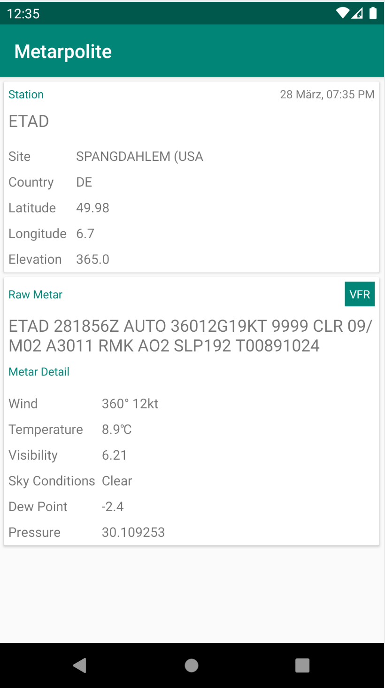

# Metarpolite

A METAR browser for Android, so that anyone can quickly search and browse the NOAA database. Currently this app only shows data for germany stations. All the data is being fethced, parsed and shown from aviationweather.gov database.

   

**Things which need to be considered:** 

1. [x] 100% java language
2. [x] MVVM architecture with data binding and injection.
3. [x] Only the Google APIs and official libraries are used.
4. [x] The app is useable offline, meaning that whenever it is online, the latest reports will be downloaded locally every hour.

## Project Structure
    metarpolite
    ├─ app
    │  ├─ src
    │  │  ├─ androidTest
    │  │  └─ main
    │  │  │  ├─ java
    │  │  │  │  └─ com/muhaammaad/metarpolite/di
    │  │  │  │  └─ com/muhaammaad/metarpolite/di/component
    │  │  │  │  └─ com/muhaammaad/metarpolite/di/annotation
    │  │  │  │  └─ com/muhaammaad/metarpolite/di/component
    │  │  │  │  └─ com/muhaammaad/metarpolite/di/factory
    │  │  │  │  └─ com/muhaammaad/metarpolite/global
    │  │  │  │  └─ com/muhaammaad/metarpolite/global/util
    │  │  │  │  └─ com/muhaammaad/metarpolite/global/constant
    │  │  │  │  └─ com/muhaammaad/metarpolite/global/IdlingResource
    │  │  │  │  └─ com/muhaammaad/metarpolite/manager
    │  │  │  │  └─ com/muhaammaad/metarpolite/model
    │  │  │  │  └─ com/muhaammaad/metarpolite/model/type
    │  │  │  │  └─ com/muhaammaad/metarpolite/network
    │  │  │  │  └─ com/muhaammaad/metarpolite/persistence
    │  │  │  │  └─ com/muhaammaad/metarpolite/persistence/repo
    │  │  │  │  └─ com/muhaammaad/metarpolite/persistence/entity
    │  │  │  │  └─ com/muhaammaad/metarpolite/persistence/db
    │  │  │  │  └─ com/muhaammaad/metarpolite/persistence/dao
    │  │  │  │  └─ com/muhaammaad/metarpolite/ui
    │  │  │  │  └─ com/muhaammaad/metarpolite/ui/main
    │  │  │  │  └─ com/muhaammaad/metarpolite/ui/main/adapter
    │  │  │  │  └─ com/muhaammaad/metarpolite/ui/main/util
    │  │  │  │  └─ com/muhaammaad/metarpolite/ui/main/viewmodel
    │  │  │  │  └─ com/muhaammaad/metarpolite/ui/main/view
    │  │  │  │  └─ com/muhaammaad/metarpolite/ui/detail
    │  │  │  │  └─ com/muhaammaad/metarpolite/ui/detail/viewmodel
    │  │  │  │  └─ com/muhaammaad/metarpolite/ui/detail/view
    │  │  │  ├─ res
    │  │  │  └─ AndroidManifest.xml
    │  │  └─test
    │  ├─ build.gradle
    │  └─ proguard-rules.pro
    ├─ build.gradle
    └─ settings.gradle

## Main Dependencies

    Room, Retrofit2, Dagger2, RxJava, RxAndroid, Espresso
 
